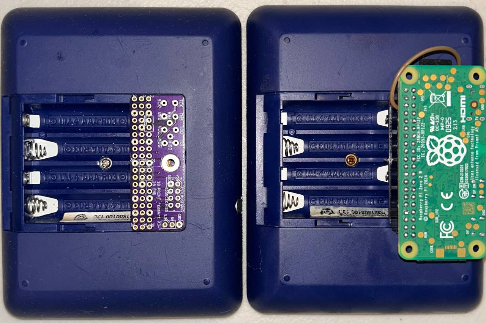
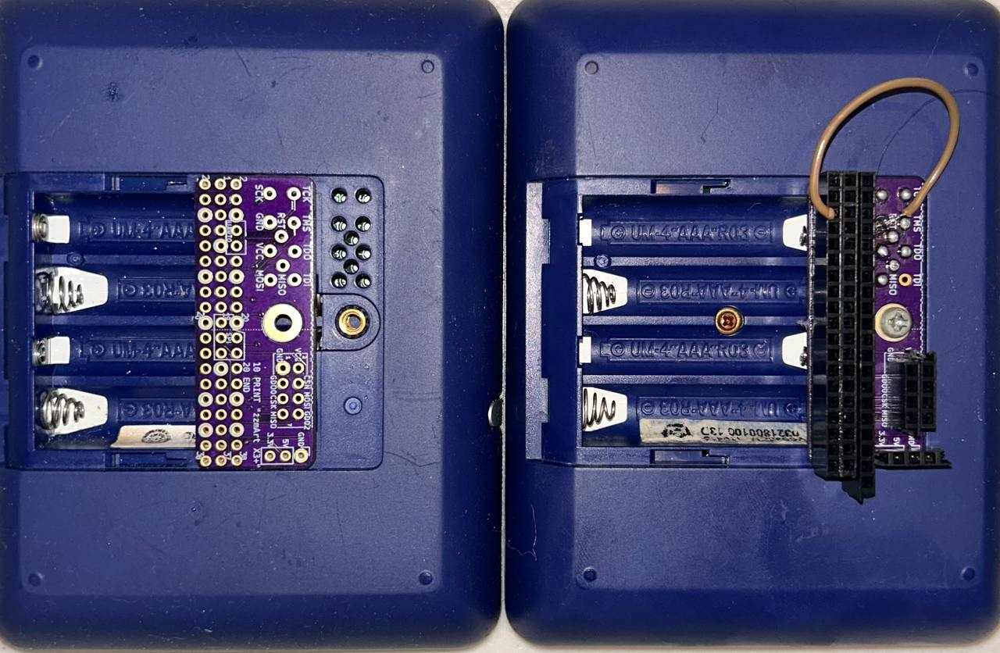
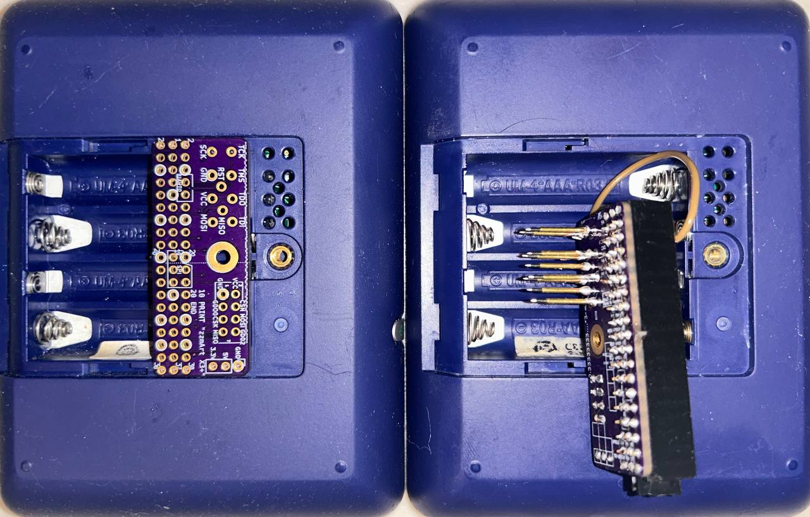
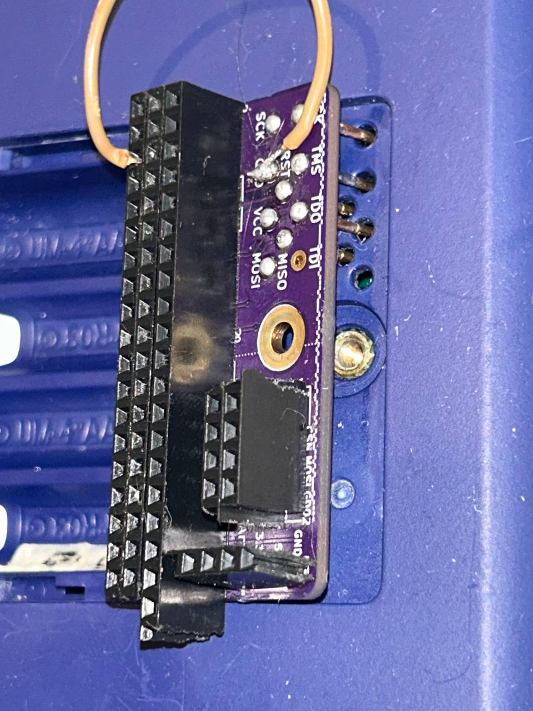

# PiToSmartXeDuino

Turn a forgotten classroom gadget into a portable Linux terminal.
I have always liked those mono lcd pixelated displays and had to do something with this one.






## What is This?

Remember those clicker devices schools used for quizzes? The SMART Response XE was one of them - a handheld unit with a full QWERTY keyboard and a monochrome screen that students used to answer questions. They were discontinued years ago and thousands ended up in surplus bins.
This project gives them new life by converting a SMART Response XE into a hardware terminal for a Raspberry Pi Zero 2W. You type commands on the XE's keyboard, see output on its screen, and the Pi does all the computing. It's a self-contained, battery-powered Linux terminal that fits in your hand.

This project wants to turn those SMART XE into a keyboard/display shield for the Raspberry Pi Zero 2w.

## Why Would You Want This?

**Nostalgia**: Remember when computers had actual keyboards attached and weren't just touchscreens?

**Portability**: A complete Linux system with a physical keyboard that runs for hours on AA batteries.

**Learning**: It's a fantastic way to learn about serial protocols, embedded systems, and creative hardware reuse.

**Fun**: Because making old hardware do new tricks and be able to repurposed them and give them new life it's fun!.

## What Does It Do?

In practical terms:
- Type commands on the XE keyboard → they appear on the XE screen
- Press enter → command runs on the Pi
- Output displays on the XE screen
- Switch between 4 different font sizes on the fly
- Scroll through command history
- All the power of Linux in your pocket

Think of it as a vintage-looking cyberdeck, or a Game Boy that runs bash.

## The Technical Bit (Overview)

If you're curious about how this works under the hood:

**Hardware**: The Raspberry Pi Zero 2W connects to the SMART Response XE through an adapter board that plugs into the XE's JTAG header (the pins on the back normally used for firmware updates). No modifications to the XE itself are needed - the adapter board replaces the battery cover.

**Communication**: The two devices talk using a software-implemented serial protocol at 19,200 baud. The Pi uses the hardware serial port pins and the `pigpio` library to read a flag set by the Arduino to let the pi know it's ready to receive data, while the Arduino-based XE bitbangs serial data through its JTAG pins (TDO, TCK, TMS, TDI it's free for you to use it and connected to pin 37 on the Pi).

**Division of Labor**: The XE is a "dumb terminal" - it only handles keyboard scanning and screen rendering. The Pi runs all the actual commands, manages the terminal buffer, and decides what to display. This keeps the XE's ATmega128RFA1 microcontroller focused on what it does best: presenting text and capturing the keys.

**Optimization**: Instead of sending every keystroke individually (which would be slow), the XE buffers an entire command line locally, showing you what you type with a blinking cursor, and only sends the complete line when you press Enter. The Pi then executes the command and sends back only the screen lines that changed.

## Current Status

**What works:**
- Full keyboard input with modifier keys (Shift, Sym)
- Terminal emulation (bash, most CLI programs)
- Four font sizes (52x17, 64x17, 32x8, 25x8 characters)
- Command execution with output display
- Screen scrolling
- Efficient differential screen updates
- Buffered line input (reduced round-trips)

**What doesn't work yet:**
- Full-screen terminal applications (nano, vim, top) - these need proper VT100 escape sequence handling
- Special characters/graphics that don't fit in the limited font

**Known quirks:**
- The XE keyboard matrix is tied to the hardware serial pins, so we use software serial on the JTAG pins instead
- Some XE units have noisy keyboards (filtering implemented)
- Font switching clears the screen (by design - different layouts)

## Quick Hardware Overview

```
┌─────────────────────────────────┐
│   SMART Response XE             │
│  ┌──────────────────────────┐   │
│  │  384x136 LCD Screen      │   │
│  └──────────────────────────┘   │
│                                  │
│  [QWERTY Keyboard Layout]        │
│                                  │
│  ATmega128RFA1 MCU               │
│                                  │
│  ┌────────────────┐              │
│  │ JTAG Header    │              │
│  │ (TDO/TCK/TMS)  │              │
│  └────────┬───────┘              │
└───────────┼──────────────────────┘
            │
            │  Soft Serial @ 19200 baud
            │  (3 wires: TX, RX, Signal)
            │
      ┌─────▼──────────────────────┐
      │  Adapter Board              │
      │  (replaces battery cover)   │
      └─────┬──────────────────────┘
            │
            │  40-pin GPIO connector
            │
      ┌─────▼──────────────────────┐
      │  Raspberry Pi Zero 2W       │
      │                             │
      │  - Runs Python terminal     │
      │  - Executes commands        │
      │  - Manages screen buffer    │
      │  - 512MB RAM, quad-core     │
      └─────────────────────────────┘
```

## Project Philosophy

This project embraces the "boring technology" philosophy:
- **Pi side**: Python with standard libraries (serial, subprocess, no exotic dependencies)
- **Arduino side**: Plain C++ with minimal libraries
- **Protocol**: Simple packet-based serial communication with checksums
- **Screen library**: Built on bitbank2's excellent SmartResponseXE library

The goal is reliability and understandability over cleverness, but I had to make use of CLAUDE to optimize the duino side to get the serial speed to 19200, using typical read/write I was able to get to 4800 and nothing more. You should be able to read the code, understand what it does, and fix it when it breaks.

## Next Steps

If you want to build one of these, jump to:
- **[Hardware Setup](docs/HARDWARE.md)** - Wiring and assembly
- **[Installation](docs/INSTALLATION.md)** - Software setup
- **[Usage Guide](docs/USAGE.md)** - How to use it

If you want to understand how it works:
- **[Architecture](docs/ARCHITECTURE.md)** - System design
- **[Protocol Specification](docs/PROTOCOL.md)** - Communication details
- **[Development Guide](docs/DEVELOPMENT.md)** - Contributing

## Credits

This project builds on the work of many people who've documented and hacked the SMART Response XE platform:

- **bitbank2** - [SmartResponseXE library](https://github.com/bitbank2/SmartResponseXE) that makes the screen work and reads the keyboard.
- The SMART Response XE community - Years of documentation on the hardware
- **Larry Bank** - Original XE reverse engineering work

The adapter board design, soft serial implementation, terminal protocol, and integration are original to this project.

## License

GPL-3.0 - See LICENSE file for details.

---

*"please document what you do with all this info so in the future some poor soul that decides to work on this have this info"* - Comment found in the code
