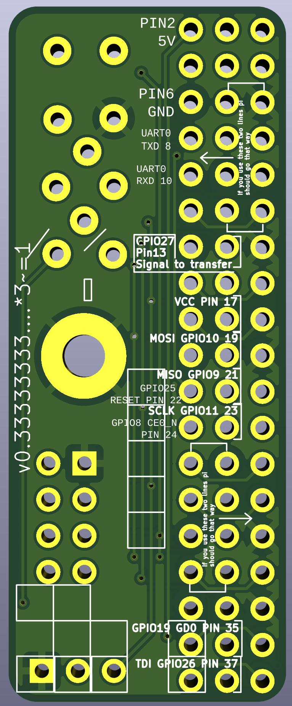
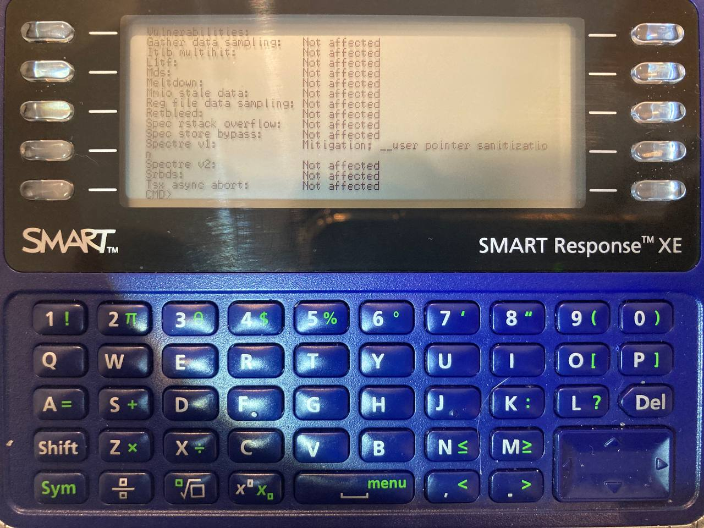
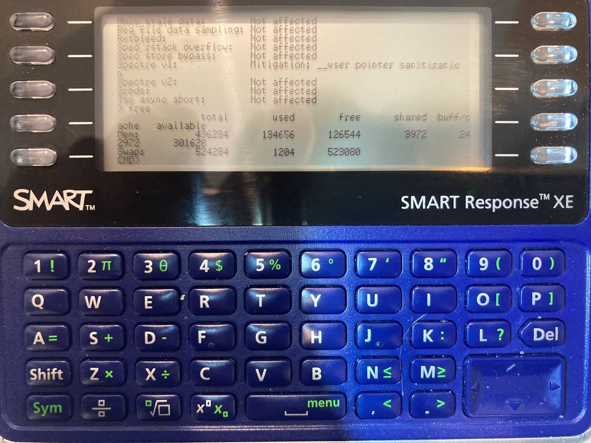
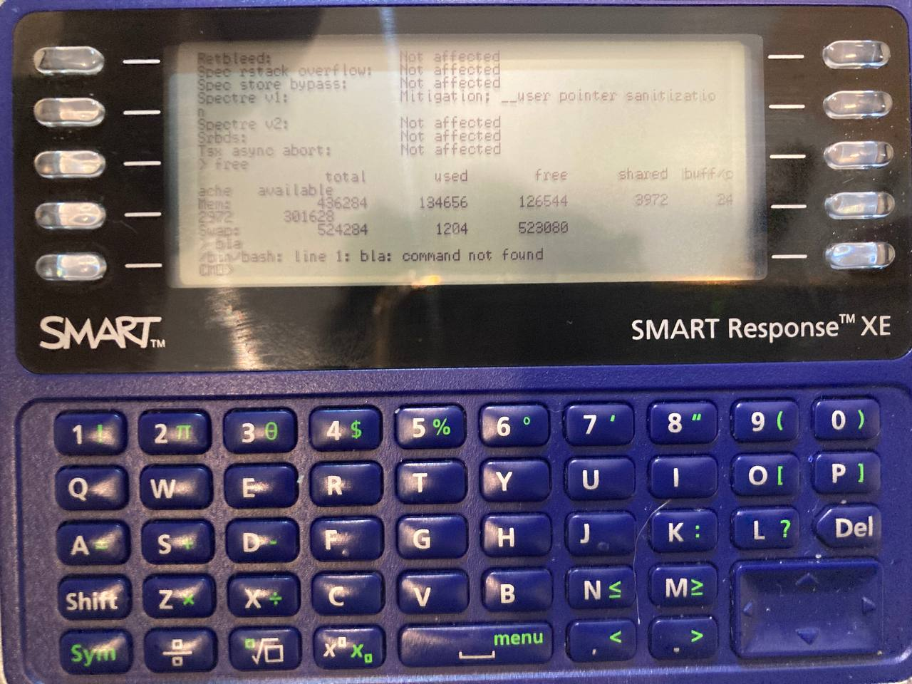
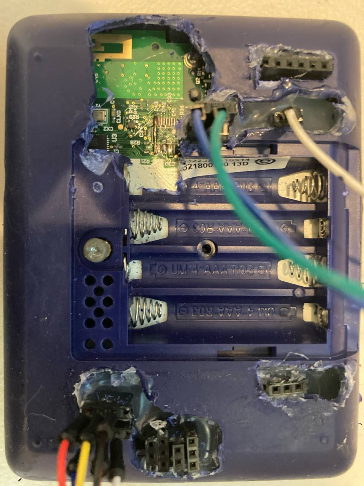
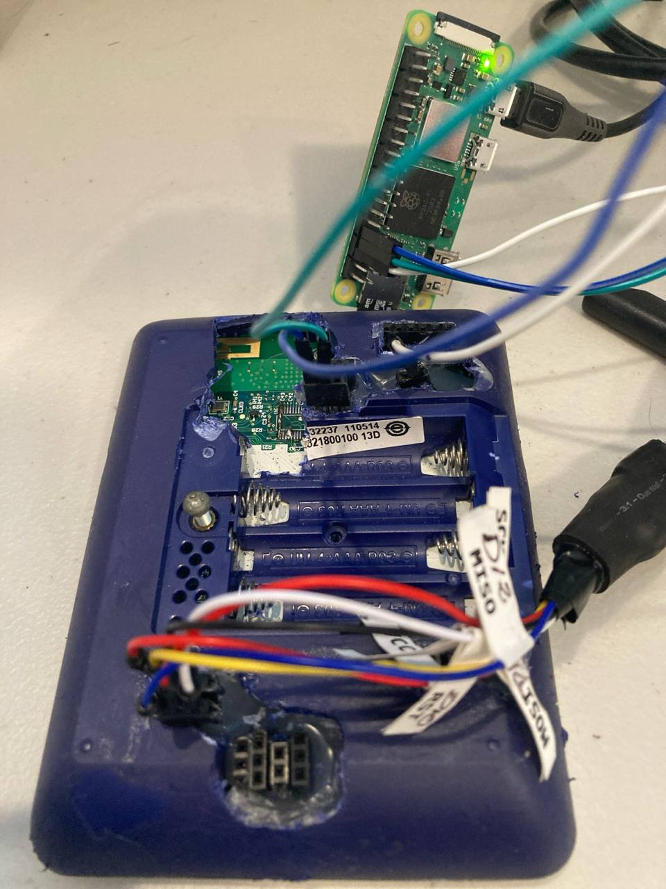
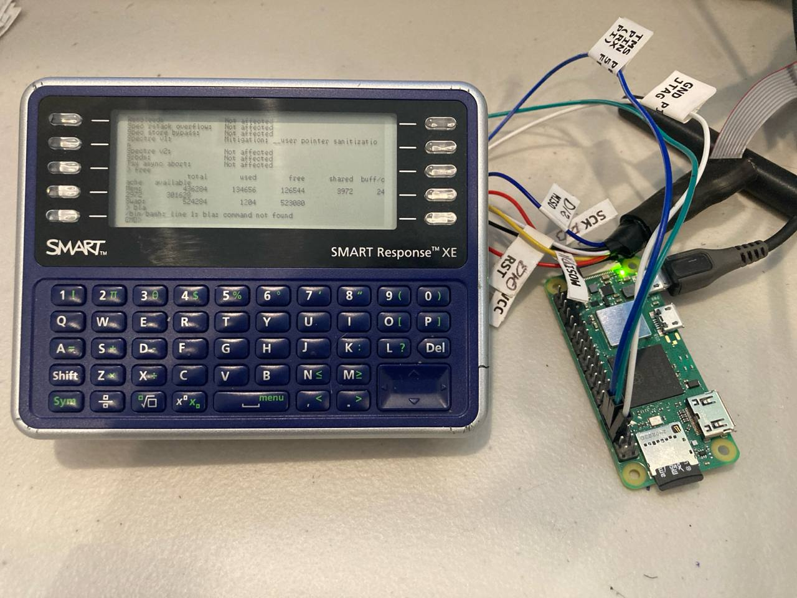

# PiToSmartXeDuino

PiToSmartXeDuino aims to use the Smart Xe as the keyboard and screen for a raspberry, in this case a pi zero 2w (you are going to read here like 10,000 different names for the berry and the pi including the typo of the Raspeberry which I'm to lazy to fix).

Right now, the duino is able to send the keys to the pi and the pi, executes the command, and send to duino what it needs to print on the screen.

In that sense the pi handles all the "intelligence", it has all the logic, keeps the status of the terminal, what's need to be send, what has been sent from the duino.

The duino in the other side just know to print whatever it receives from the pi and send to pi the keys pressed.

Communication is through the serial port, the SmartXe has a serial with pads but needs wires to bridge a missing component to be able to be used.

This project is based on:

- this library by amazing https://github.com/bitbank2/SmartResponseXE by bitbank
- a ton of people how have done a lot of work to document the platform

The thing right now works as a terminal to the pi, in the sense that you can type commands and see results.
It cannot display yet say a nano editor window or top because that will probably require more refinement.

There are a couple of optimizations:
- If the command and the response are two lines, the screen is being "scrolled" up two lines and you print just the new lines
- If you need to print everything, right now we are printing just the chars that are needed to cover the previous string in the screen

## Progress

I initially tried to make a board to use on the back of the smartxe with pogo pins to the places where I wanted to connect, this approach had several issues

 - location issues, some of those pins are extremely small and I failed to put in the board a way to secure attachment to the xe board
 - the serial 2 is tied to the keys, and caused issues, on top of that
   - I had to remove to resistors to free the serial
   - Then route those lines to the tdo and tdi to detect the keys and use the serial
   - Serial is not wired
 - You have to open the xe

So I took a different approach, try to do everything from the pins exposed in the back of the XE, that required bitbanging a serial protocol through the tdo/tck/tms which took a couple tries to get fixed.

Then I would like to use the  device I connect to also program the smart xe, I was not able to do this using a lepotato but did work with a raspberry pi zero 2w.

You can find also the board to connect the pi to the xe in the KicadBerryShield (should that be smartxeshield?)
The idea is that the adapter board is screwed to the case instead of the cover for the battery, and then you can add a device that uses a 40 pin connector like the raspberry pi ones.
Notice that the board  can have the pi in 2 possitions, 
- one like the xe is a gigantic shield for the pi, in this case the pins face into the xe and you see the bottom of the pi.
- the other one using the top two lines closer to the screw so the pins face out and you can use them to add another shield, in this case you should solder the pins on the lower part of the pi and the top of the pi face up.

How the pi should fit when you use the top 2 lines

After running lscpu

After running free

After running bad command bla

